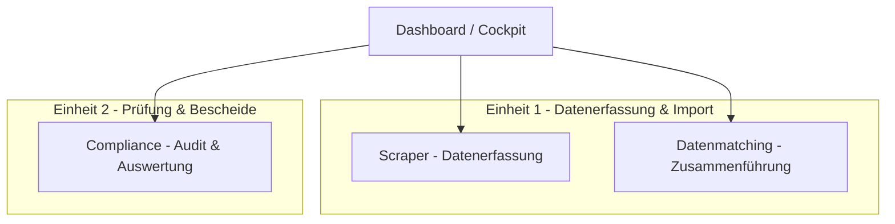

# Spezifikation: Compliance & Audit Hub (§ 42 EnWG / BDEW-Leitfaden)

Dieses Dokument spezifiziert die Erweiterung des SKZ-Scrapers zu einem behördlichen **Compliance & Audit Hub**. Das System ermöglicht einer Regulierungsbehörde die Überwachung der gesetzlichen Stromkennzeichnungspflichten (§ 42 EnWG) deutscher Energieversorger sowie den Abgleich mit den tatsächlich entwerteten Herkunftsnachweisen (HKN) des Umweltbundesamtes (UBA).

---

## 1. Systemarchitektur & Workflow (4-Säulen-Modell)

Das System wird in vier funktionale Arbeitsbereiche unterteilt, um eine klare Aufgabentrennung zwischen der Datenerfassung (_Einheit 1_) und der rechtlichen Prüfung (_Einheit 2_) zu gewährleisten:



### Die 4 Arbeitsbereiche (Tabs)

1. **Dashboard (Cockpit):** Globale Statistiken zur aktuellen Kampagne (Fortschritt der Erfassung, Anzahl beanstandeter Versorger, aggregierte Quoten).
2. **Scraper (Datenerfassung):** Das bestehende Dashboard mit den Scraper-Läufen, Jobs, Logs, Supabase-Dokumenten und der Gemini-basierten Extraktion der Stromkennzeichnung.
3. **Datenmatching (Datenzusammenführung):** Arbeitsbereich für _Einheit 1_. Ermöglicht den Import von UBA-HKN-Entwertungsberichten und Stromliefermengen (CSV) sowie die manuelle Nachpflege/Korrektur dieser Daten pro Anbieter und Jahr.
4. **Compliance (Prüfung & Auswertung):** Arbeitsbereich für _Einheit 2_. Hier läuft die Plausibilitäts-Engine. Es werden Abweichungen berechnet, Fehler farblich markiert und Prüfer können Notizen (Prüfvermerke) verfassen sowie den Status (`plausibel`, `beanstandet`, etc.) festlegen.

---

## 2. Datenmodell & Schema-Erweiterungen (PostgreSQL)

Folgende Tabellen werden zur datenbankseitigen Abbildung der behördlichen Prüfung neu angelegt. Alle Tabellen sind PostgreSQL-kompatibel (Neon/Supabase).

```sql
-- 1. Jährliche Bundes-Konstanten & Bundesmix-Werte (BNetzA/UBA)
CREATE TABLE IF NOT EXISTS federal_constants (
    year INT PRIMARY KEY,
    eeg_percentage DECIMAL(5,2) NOT NULL, -- bundesweiter EEG-Sollwert (z.B. 57.90 für 2024)
    renewable_percentage DECIMAL(5,2) NOT NULL,
    fossil_percentage DECIMAL(5,2) NOT NULL,
    nuclear_percentage DECIMAL(5,2) NOT NULL,
    co2_emission_g_kwh DECIMAL(6,2) NOT NULL,
    radioactive_waste_mg_kwh DECIMAL(10,4) NOT NULL,
    created_at TIMESTAMP DEFAULT CURRENT_TIMESTAMP,
    updated_at TIMESTAMP DEFAULT CURRENT_TIMESTAMP
);

-- 2. Provider Jahres-Statistiken (Strommengenlieferung)
CREATE TABLE IF NOT EXISTS provider_yearly_stats (
    id SERIAL PRIMARY KEY,
    provider_id INT NOT NULL REFERENCES providers(id) ON DELETE CASCADE,
    year INT NOT NULL,
    delivered_volume_mwh DECIMAL(15,2) NOT NULL, -- Gelieferte Strommenge an Letztverbraucher
    created_at TIMESTAMP DEFAULT CURRENT_TIMESTAMP,
    updated_at TIMESTAMP DEFAULT CURRENT_TIMESTAMP,
    CONSTRAINT unique_provider_year UNIQUE (provider_id, year)
);

CREATE INDEX IF NOT EXISTS idx_provider_year_stats ON provider_yearly_stats (provider_id, year);

-- 3. Tatsächlich entwertete HKN (UBA Herkunftsnachweisregister-Daten)
CREATE TABLE IF NOT EXISTS hkn_cancellations (
    id SERIAL PRIMARY KEY,
    provider_id INT NOT NULL REFERENCES providers(id) ON DELETE CASCADE,
    year INT NOT NULL,
    country VARCHAR(100) NOT NULL, -- Herkunftsland der HKN (z.B. "Schweden")
    amount_mwh DECIMAL(15,2) NOT NULL, -- Entwertete Menge in MWh
    created_at TIMESTAMP DEFAULT CURRENT_TIMESTAMP,
    CONSTRAINT unique_provider_year_country UNIQUE (provider_id, year, country)
);

CREATE INDEX IF NOT EXISTS idx_hkn_cancellation_lookup ON hkn_cancellations (provider_id, year);

-- 4. Compliance Audits (Prüfvermerke und Abgleichsstatus)
CREATE TABLE IF NOT EXISTS compliance_audits (
    id SERIAL PRIMARY KEY,
    provider_id INT NOT NULL REFERENCES providers(id) ON DELETE CASCADE,
    year INT NOT NULL,
    status VARCHAR(50) DEFAULT 'offen' CHECK (status IN ('offen', 'plausibel', 'fehlerhaft_eeg', 'fehlerhaft_hkn', 'beanstandet')),
    hkn_deviation_percent DECIMAL(8,2) DEFAULT NULL, -- Prozentuale Mengen-Abweichung Soll/Ist
    audit_note TEXT DEFAULT NULL, -- Offizieller Prüfvermerk
    audited_by VARCHAR(100) DEFAULT NULL, -- Kürzel/Name des Sachbearbeiters
    audited_at TIMESTAMP DEFAULT NULL,
    created_at TIMESTAMP DEFAULT CURRENT_TIMESTAMP,
    updated_at TIMESTAMP DEFAULT CURRENT_TIMESTAMP,
    CONSTRAINT unique_audit_provider_year UNIQUE (provider_id, year)
);

CREATE INDEX IF NOT EXISTS idx_compliance_audit_lookup ON compliance_audits (provider_id, year);
CREATE INDEX IF NOT EXISTS idx_compliance_audit_status ON compliance_audits (status);
```

---

## 3. CSV-Schnittstelle & Matching-Logik (Datenmatching)

Einheit 1 kann Entwertungs- und Lieferdaten über ein standardisiertes CSV-Format hochladen.

### CSV-Struktur

```csv
anbieter_name,berichtsjahr,strommenge_mwh,hkn_land,hkn_menge_mwh
AggerEnergie GmbH,2024,100000.00,Schweden,32000.00
AggerEnergie GmbH,2024,100000.00,Norwegen,8000.00
Stadtwerke Leipzig GmbH,2024,450000.00,Lettland,12000.00
```

### Matching-Prozedur im Backend

Beim Upload einer Datei wird für jede Zeile folgendes Schema angewandt:

1. **Provider-Identifikation:** Das System sucht den Provider in `providers` anhand des Feldes `anbieter_name`.
    - _Fallback-Matching:_ Wenn kein exakter Treffer existiert, wird der Name normalisiert (Entfernung von GmbH, AG, Co. KG, Groß-/Kleinschreibung) und abgeglichen. Schlägt dies fehl, wird die Zeile im Import-Log als "Unbekannter Anbieter - Manuelle Zuordnung erforderlich" markiert.
2. **Strommenge speichern:** Der Wert `strommenge_mwh` wird in `provider_yearly_stats` für das angegebene Jahr eingetragen (mittels `INSERT ... ON CONFLICT (provider_id, year) DO UPDATE`).
3. **HKN-Entwertungen speichern:** Für jedes angegebene `hkn_land` wird die `hkn_menge_mwh` in `hkn_cancellations` gespeichert. Existiert für den Provider, das Jahr und das Land bereits ein Eintrag, wird dieser aktualisiert.

---

## 4. Compliance-Berechnungs-Engine

Die Engine führt pro Anbieter und Jahr folgende mathematische Abgleiche durch, basierend auf dem BDEW-Leitfaden:

### 1. HKN-Mengen-Abgleich (Soll vs. Ist)

- **Soll-HKN-Volumen ($V_{\text{Soll}}$) in MWh:**
  $$V_{\text{Soll}} = \frac{\text{SKZ-HKN-\%} \times \text{Gelieferte Strommenge (MWh)}}{100}$$
  _(SKZ-HKN-% entspricht `hkn_percentage` aus der Tabelle `energy_mix`)_
- **Ist-HKN-Volumen ($V_{\text{Ist}}$) in MWh:**
  Summe aller `amount_mwh` aus `hkn_cancellations` für diesen Provider und dieses Jahr.
- **Prozentuale Mengen-Abweichung (Behörden-Filterkriterium):**
  $$\text{Abweichung (\%)} = \frac{V_{\text{Ist}} - V_{\text{Soll}}}{V_{\text{Soll}}} \times 100$$
    - _Interpretation:_ Ein negativer Wert (z. B. $-8,50\%$) bedeutet eine Unterdeckung von HKN-Zertifikaten (Verstoß).
- **Prozentpunkt-Abweichung im deklarierten Strommix:**
  $$\text{Differenz (Prozentpunkte)} = \left(\frac{V_{\text{Ist}}}{\text{Gelieferte Strommenge}} \times 100\right) - \text{SKZ-HKN-\%}$$

### 2. Validierungs- und Alarmregeln (BDEW-Leitfaden)

Das System generiert bei folgenden Bedingungen Warnungen:

1. **EEG-Abweichung (Kritisch):** Weicht der in der SKZ extrahierte `eeg_percentage` vom gesetzlich festgesetzten Sollwert des Bundes in `federal_constants.eeg_percentage` ab, wird eine rote Warnung ausgegeben.
2. **HKN-Unterdeckung (Kritisch):** Wenn die prozentuale Mengen-Abweichung negativ ist und die Toleranzgrenze (0,5 %) überschreitet.
3. **Länder-Diskrepanz (Medium):** Weicht die Menge der deklarierten Länderanteile im Strommix (`hkn_origins`) signifikant von den tatsächlich entwerteten HKN-Ländern in `hkn_cancellations` ab (z. B. Versorger deklariert "Island", entwertet hat er laut UBA aber "Norwegen").

---

## 5. UI-Komponenten & Filter-Schnittstelle

Das Front-End wird durch einen zentralen "Compliance-Bereich" ergänzt, der für Einheit 2 optimiert ist.

### 1. Compliance Dashboard & Tabellen-Ansicht

Die Tabelle zeigt alle Anbieter mit ihren Berechnungsdaten für das gewählte Berichtsjahr:

- **Spalten:** Anbietername | Gelieferte Strommenge (MWh) | SKZ-Status | HKN-Soll (MWh) | HKN-Ist (MWh) | HKN-Abweichung (%) | Differenz (Prozentpunkte) | EEG-Check | Länder-Check | Status | Aktionen
- **Farbkodierung (Ampelsystem):**
    - `Grün` (Plausibel): Alle Prüfungen bestanden, Abweichung innerhalb der Toleranz.
    - `Gelb` (Warnung): Geringe Abweichung (z. B. HKN-Abweichung < 1 % oder Länderanteile weichen leicht ab).
    - `Rot` (Kritisch): HKN-Unterdeckung > 1 % oder falsche EEG-Quote ausgewiesen.

### 2. Behörden-Filterleiste

Die Compliance-Tabelle besitzt eine erweiterte Filterleiste, um Problemfälle gezielt zu isolieren:

- **Filter nach Status:** `Alle` | `Offen` | `Plausibel` | `Beanstandet`
- **Filter nach HKN-Abweichung (Richtung & Grad):**
    - _Richtung:_ `Alle` | `Unterdeckung (negativ)` | `Überdeckung (positiv)`
    - _Grad:_ Schieberegler oder Eingabefeld für den Prozentsatz der Abweichung (z. B. _"Zeige nur Abweichungen > X %"_).

### 3. Audit- & Prüfvermerk-Modal

Bei Klick auf "Prüfen" öffnet sich die Detailkarte für den Sachbearbeiter von Einheit 2:

- Visualisierung des Soll/Ist-Vergleichs als Balkendiagramm.
- Auflistung aller automatischen Fehlermeldungen (z.B. _"Achtung: EEG-Quote beträgt 56,1 % statt der vorgeschriebenen 57,9 %"_).
- **Eingabebereich für Prüfvermerk:**
    - Status-Dropdown (`plausibel`, `beanstandet`, `fehlerhaft_hkn`, etc.).
    - Textfeld für den Prüfvermerk (z. B. _"Schriftliche Anhörung des Versorgers am 28.05.2026 eingeleitet wegen Unterdeckung von 400 MWh"_).
    - Speichern-Button: Trägt die Notiz und den Status in `compliance_audits` ein und aktualisiert den Gesamtstatus des Anbieters.

---

## 6. Verifikationsplan

### Automatisierte Tests (Vitest)

1. **Matching-Engine-Tests:** Unit-Tests zur Überprüfung der CSV-Matching-Logik (inklusive fehlertolerantem Namensabgleich).
2. **Rechen-Engine-Tests:** Mathematische Überprüfung der HKN-Abweichungsformeln mit Mock-Daten (Soll/Ist-Vergleich, Mengen-Abweichung in %, Prozentpunkte).
3. **BDEW-Validierungs-Tests:** Testen der Alarmregeln (Korrekter Fehlerwurf bei falscher EEG-Quote oder Länderdiskrepanzen).

### Manuelle Verifikation (E2E-Tests)

1. Hochladen einer Test-CSV im Datenmatching-Bereich für das Jahr 2024.
2. Überprüfung der Datenübernahme im Datenmatching-Tab.
3. Wechsel zum Compliance-Tab, Filtern nach "Unterdeckung > 5 %" und Verifizieren der farblichen Markierung.
4. Öffnen des Audit-Modals, Eintragen eines Prüfvermerks und Validieren der Speicherung in der PostgreSQL-Datenbank.
